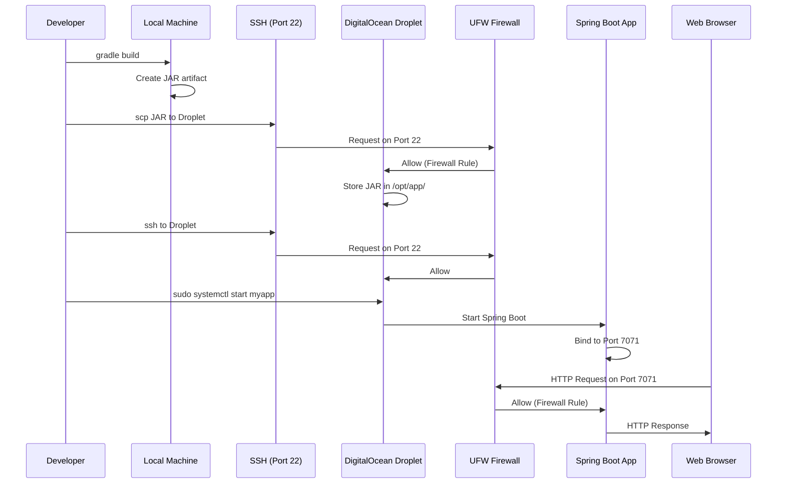
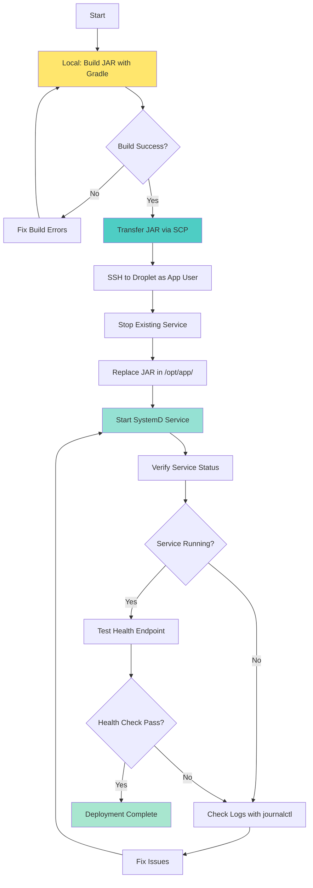

# Cloud Server Foundation - Architecture

## System Architecture

This document describes the architecture of the Cloud Server Foundation deployment on DigitalOcean.

### System Components

```mermaid
graph TB
    subgraph "Local Development Environment"
        DEV[Developer Workstation]
        GRADLE[Gradle Build]
        JAR[JAR Artifact]
        DEV --> GRADLE
        GRADLE --> JAR
    end
    
    subgraph "DigitalOcean Cloud"
        subgraph "Ubuntu 22.04 Droplet"
            subgraph "Network Layer"
                UFW[UFW Firewall<br/>Port 22: SSH<br/>Port 7071: App]
            end
            
            subgraph "User Layer"
                ROOT[Root User<br/>SSH Disabled]
                APPUSER[Application User<br/>SSH Key Auth<br/>Sudo Access]
            end
            
            subgraph "Runtime Layer"
                JAVA[Java 17 JDK]
                GRADLE_SERVER[Gradle 8.x]
            end
            
            subgraph "Application Layer"
                APPDIR[/opt/app/<br/>JAR Location]
                SYSTEMD[SystemD Service<br/>Auto-start<br/>Auto-restart]
                SPRINGBOOT[Spring Boot App<br/>Port 7071]
            end
            
            UFW --> APPUSER
            APPUSER --> JAVA
            JAVA --> SPRINGBOOT
            SYSTEMD --> SPRINGBOOT
            APPDIR --> SPRINGBOOT
        end
    end
    
    subgraph "External Access"
        BROWSER[Web Browser]
        SSH_CLIENT[SSH Client]
    end
    
    JAR -->|SCP Transfer| APPDIR
    SSH_CLIENT -->|Port 22| UFW
    BROWSER -->|Port 7071| UFW
    
    style UFW fill:#ff6b6b
    style APPUSER fill:#4ecdc4
    style JAVA fill:#ffe66d
    style SPRINGBOOT fill:#95e1d3
    style SYSTEMD fill:#a8e6cf
```

### Network Flow



## Deployment Workflow



## Component Details

### 1. DigitalOcean Droplet
- **OS**: Ubuntu 22.04 LTS
- **IP**: YOUR_DROPLET_IP
- **Specs**: 1-2 vCPU, 1-2GB RAM, 25-50GB SSD
- **Purpose**: Host the Java Spring Boot application

### 2. UFW Firewall
- **Port 22**: SSH access (key-based authentication only)
- **Port 7071**: Application HTTP access
- **Default Policy**: Deny all incoming, allow all outgoing

### 3. User Management
- **Root User**: SSH disabled, console access only
- **Application User** (appuser): SSH enabled with key auth, sudo access

### 4. Java Runtime
- **Version**: OpenJDK 17 LTS
- **Location**: /usr/lib/jvm/java-17-openjdk-amd64
- **Purpose**: Run Spring Boot application

### 5. Application Structure
```
/opt/app/
├── current/        # Current running JAR
│   └── app.jar
├── releases/       # Previous versions
├── logs/           # Application logs
└── config/         # External configuration
```

### 6. SystemD Service
- **Name**: myapp.service
- **User**: appuser
- **Auto-start**: Enabled on boot
- **Auto-restart**: On failure
- **Logs**: journalctl -u myapp

### 7. Spring Boot Application
- **Port**: 7071
- **Health Endpoint**: /actuator/health
- **Info Endpoint**: /actuator/info

## Security Architecture

### SSH Hardening
- Root login disabled
- Password authentication disabled
- Key-based authentication only
- Non-root user with sudo access

### Firewall Configuration
- Minimal open ports (22, 7071)
- Default deny policy
- Explicit allow rules only

### Application Security
- Runs as non-root user
- SystemD security settings (NoNewPrivileges, PrivateTmp)
- Resource limits configured

## Deployment Process

1. **Build**: Compile and package application locally
2. **Transfer**: SCP JAR to Droplet
3. **Deploy**: Replace JAR in /opt/app/current/
4. **Restart**: Restart SystemD service
5. **Verify**: Check health endpoint

## Monitoring and Troubleshooting

### Health Checks
- **Endpoint**: http://YOUR_DROPLET_IP:7071/actuator/health
- **Expected**: HTTP 200 with status "UP"

### Logs
- **SystemD logs**: `sudo journalctl -u myapp -f`
- **Application logs**: Captured by journald

### Common Issues
- **Connection refused**: Check firewall rules
- **Service won't start**: Check Java version and JAR path
- **Permission denied**: Check file ownership and permissions
